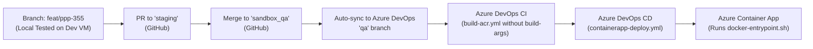

# PPP-355: Azure DevOps Guide for Runtime Environment Configuration

**Ticket Reference:** PPP-355  
**Target Services:** `fintech_admin_webapp` & `fintech_webapp`  
**Role:** DevOps Engineer  
**Objective:** Transition frontend applications from build-time environment variable baking (`--build-arg`) to runtime configuration (`window.env`), enabling a single, environment-agnostic Docker image to be deployed across DEV, QA, and PROD.

---

## 1. Architecture Overview: Before vs After

### Before (Build-Time Baking)
```
Git Push -> CI Pipeline (passes --build-arg) -> Webpack inlines process.env strings into JS bundle -> ACR Image is tied to a single environment -> Changing a URL or key required a FULL code rebuild.
```

### After (Runtime Configuration with `window.env`)
```
Git Push -> CI Pipeline builds generic Docker image (NO build args) -> Pushed to ACR once ->
CD Pipeline deploys image to Azure Container Apps (ACA) ->
ACA injects Variable Group variables as Container OS Environment Variables ->
Container boots up -> Nginx executes /docker-entrypoint.d/40-env-config.sh ->
Generates /usr/share/nginx/html/env-config.js (window.env = { ... }) ->
Browser reads window.env dynamically.
```

---

## 2. Azure DevOps Action Items for DevOps Engineer

As a DevOps engineer, you need to make changes in **three places** in Azure DevOps:
1. **CI Pipeline (`pipeline_CI.yml`)**
2. **CD Pipeline (`pipeline_CD.yml`)**
3. **Variable Groups (`Pipelines > Library`)**

---

### Action Item 1: CI Pipeline (`pipeline_CI.yml`)

#### What to change:
Remove all `--build-arg REACT_APP_*` from the Docker build arguments. The Docker image must be built **completely generic** without baking any environment-specific values.

#### `pipeline_CI.yml` — Before & After Comparison:

```diff
  trigger:
    branches:
      include:
      - main
      - qa

  resources:
    repositories:
    - repository: pipelines
      type: git
      name: ZB-CS - PP Digital Portal Solution/pipelines
      ref: refs/heads/main

  variables:
  - group: PlatformDetails

  extends:
    template: pipeline-ci/flow/build-acr.yml@pipelines
    parameters:
      buildMode: docker
      imageName: 'fintechadminwebapp' # or 'webapp'
      dockerfilePath: '$(Build.SourcesDirectory)/Dockerfile'
-     arguments: >
-       --build-arg REACT_APP_APP_BASE_URL=$(REACT_APP_APP_BASE_URL)
-       --build-arg REACT_APP_DEVELOPMENT=$(REACT_APP_DEVELOPMENT)
-       --build-arg REACT_APP_ENC_ALGO=$(REACT_APP_ENC_ALGO)
-       --build-arg REACT_APP_ENC_KEY=$(REACT_APP_ENC_KEY)
-       --build-arg REACT_APP_APPINSIGHTS_CONNECTION_STRING=$(REACT_APP_APPINSIGHTS_CONNECTION_STRING)
-       --build-arg REACT_APP_APP_ENV=$(REACT_APP_APP_ENV)
```

> **Why?** The Dockerfile now contains `/docker-entrypoint.d/40-env-config.sh`, which loads variables at container startup. No build arguments are needed.

---

### Action Item 2: CD Pipeline (`pipeline_CD.yml`)

#### What to verify/configure:
Ensure `renderEnv: true` is set in the `containerapp-deploy.yml` template parameters. This instructs Azure DevOps to inject the linked Variable Group directly into the Azure Container App as environment variables.

#### Example `pipeline_CD.yml`:

```yaml
trigger: none

resources:
  pipelines:
  - pipeline: ci
    source: fintech-admin-webapp CI # or fintech-webapp CI
    trigger:
      branches:
        include:
        - qa
        - main

  repositories:
  - repository: pipelines
    type: git
    name: ZB-CS - PP Digital Portal Solution/pipelines
    ref: refs/heads/main

variables:
- group: PlatformDetails

extends:
  template: pipeline-cd/flow/containerapp-deploy.yml@pipelines
  parameters:
    renderEnv: true
    secretEnv:
      REACT_APP_ENC_KEY: $(REACT_APP_ENC_KEY)
      REACT_APP_APPINSIGHTS_CONNECTION_STRING: $(REACT_APP_APPINSIGHTS_CONNECTION_STRING)
    envConfig:
      qa:
        azureServiceConnection: '$(SC_DEPLOY_PURPLEPLUM_QA)'
        resourceGroup: 'rg-purpleplum-qa-eastus'
        location: 'eastus'
        containerAppName: 'zb-qa-pp-admin-webapp-001' # or webapp
        containerRegistry: '$(ACR_LOGIN_SERVER_QA)'
        imageRepo: 'fintechadminwebapp'
        variableGroup: ZB-FintechAdminWebapp-QA
      prod:
        azureServiceConnection: '$(SC_DEPLOY_PURPLEPLUM_PROD)'
        resourceGroup: 'rg-purpleplum-prod-eastus'
        location: 'eastus'
        containerAppName: 'zb-prod-admin-webapp-001' # or webapp
        containerRegistry: '$(ACR_LOGIN_SERVER_PROD)'
        imageRepo: 'fintechadminwebapp'
        variableGroup: ZB-FintechAdminWebapp-PROD
```

---

### Action Item 3: Azure DevOps Variable Groups

Navigate to **Pipelines > Library** in Azure DevOps and ensure the following variable groups exist and contain the required keys.

#### Variable Groups to configure:
* **Admin Webapp:** `ZB-FintechAdminWebapp-QA` and `ZB-FintechAdminWebapp-PROD`
* **Main Webapp:** `ZB-FintechWebapp-QA` and `ZB-FintechWebapp-PROD`

#### Variables Matrix:

| Variable Name | Type | Value (QA) | Value (PROD) | Description |
| :--- | :--- | :--- | :--- | :--- |
| `REACT_APP_APP_BASE_URL` | Plaintext | `https://qaportal-pp.zenus.com` | `https://portal.zenus.com` (or prod URL) | Base URL for backend API calls |
| `REACT_APP_DEVELOPMENT` | Plaintext | `false` | `false` | Enables/disables development mock/logging modes |
| `REACT_APP_ENC_ALGO` | Plaintext | `aes-256-cbc` | `aes-256-cbc` | Encryption algorithm used by Axios interceptor |
| `REACT_APP_ENC_KEY` | **Secret 🔒** | *(QA encryption key)* | *(PROD encryption key)* | Payload encryption key |
| `REACT_APP_APPINSIGHTS_CONNECTION_STRING` | **Secret 🔒** | *(QA App Insights conn str)* | *(PROD App Insights conn str)* | Azure Telemetry connection string |
| `REACT_APP_APP_ENV` | Plaintext | `qa` | `prod` | Structured logger environment identifier |

---

## 3. End-to-End Promotion Workflow



1. **Step 1:** Create PR from `feat/ppp-355` into `staging` on GitHub.
2. **Step 2:** Once verified on `staging`, merge to `sandbox_qa`.
3. **Step 3:** The existing sync automation creates a PR into `qa` in Azure DevOps.
4. **Step 4:** Update `pipeline_CI.yml` in `qa` branch to remove `--build-arg`.
5. **Step 5:** The CI pipeline builds the Docker image and pushes it to ACR.
6. **Step 6:** The CD pipeline deploys the image to the Azure Container App with the QA variable group.

---

## 4. How to Verify Deployment in Azure Container Apps

### Verification Step 1: Azure Container App Environment Variables
Run the Azure CLI command to verify that the environment variables are active in the Container App:
```bash
az containerapp show \
  --name zb-qa-pp-admin-webapp-001 \
  --resource-group rg-purpleplum-qa-eastus \
  --query "properties.template.containers[0].env" \
  -o table
```

### Verification Step 2: HTTP Endpoint Check
Test that the container is serving `env-config.js` properly:
```bash
curl -s https://<your-qa-ingress-domain>/env-config.js
```
**Expected Response:**
```javascript
window.env = {
  REACT_APP_APP_BASE_URL: "https://qaportal-pp.zenus.com",
  REACT_APP_DEVELOPMENT: "false",
  REACT_APP_ENC_ALGO: "aes-256-cbc",
  REACT_APP_ENC_KEY: "...",
  REACT_APP_APPINSIGHTS_CONNECTION_STRING: "InstrumentationKey=...",
  REACT_APP_APP_ENV: "qa"
};
```

### Verification Step 3: Browser DevTools Check
1. Open the QA portal URL in your browser.
2. Open DevTools (`F12`) > **Console**.
3. Type:
   ```javascript
   window.env
   ```
4. Verify the QA environment values are loaded and API requests in the **Network** tab are hitting the QA backend endpoints.

---

## 5. Major Benefits for DevOps Operations

1. **Build Once, Deploy Anywhere (12-Factor App principle):** The exact same binary Docker image is promoted from QA to PROD without recompilation.
2. **Instant Configuration Updates:** If an API endpoint or App Insights key changes, simply update the Azure DevOps Variable Group and trigger a revision restart. Takes **under 15 seconds** without code builds.
3. **Zero Secret Leaks in Git/Docker Layers:** Secrets are no longer baked into immutable Docker image layers via `--build-arg`. They are injected at container startup.
